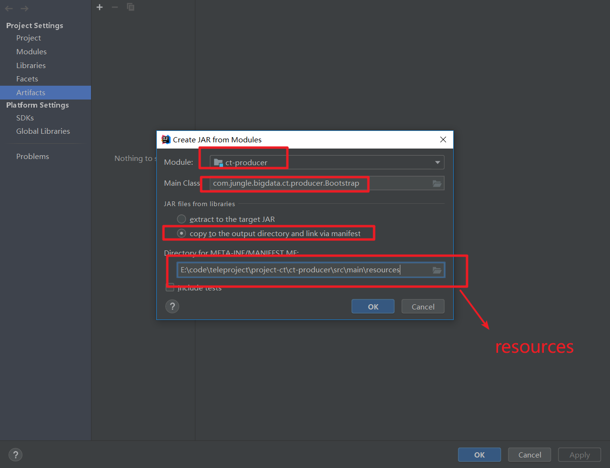
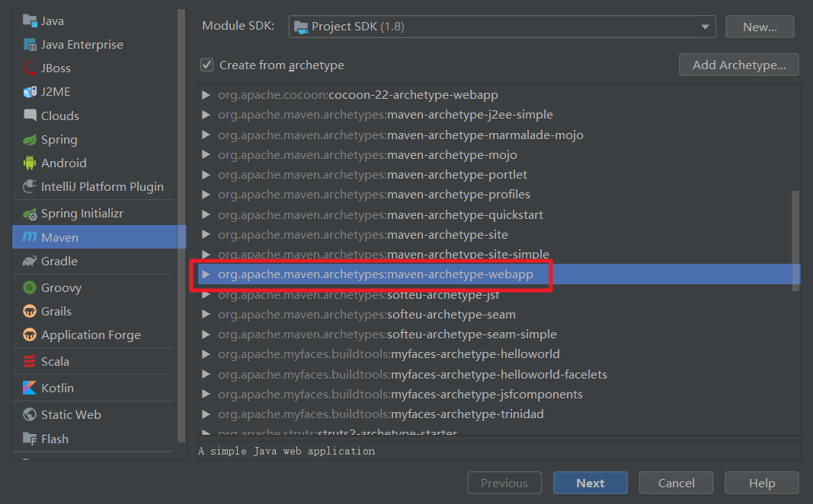
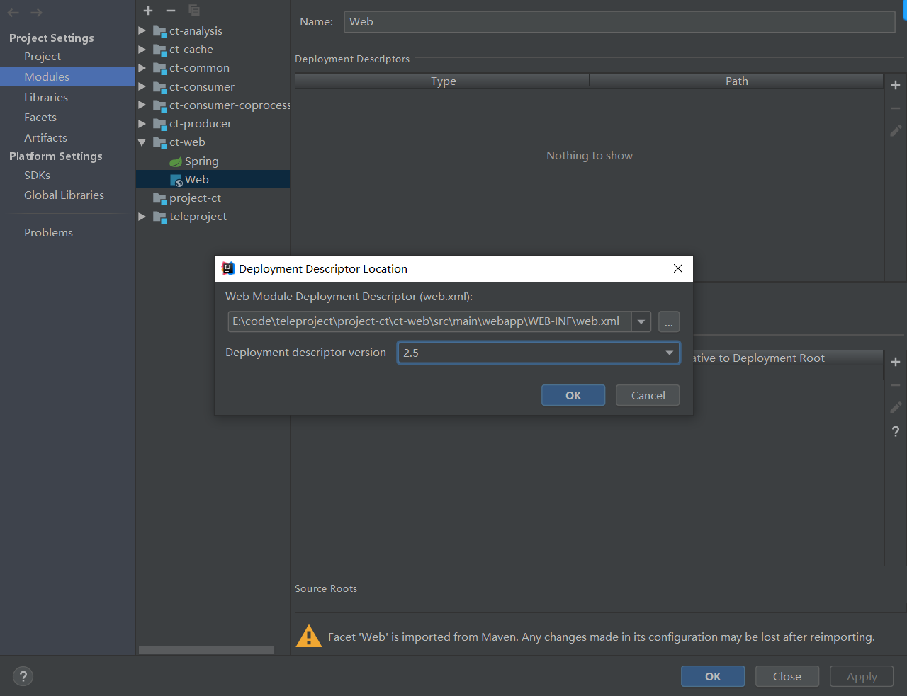

尚硅谷大数据技术之电信客服综合案例

# 第一章、项目架构

## 一、电信项目技术框架


## 二、数据分析流程


## 三、数据展示流程


## 四、消费模型


---


# 第二章、数据生产


## 一、泛型的使用

```java
/**
     * 读取数据，返回数据集合
     * @param clazz
     * @param <T>
     * @return
     * @throws IOException
     */
    public <T extends Data> List<T> read(Class<T> clazz) throws IOException {

        List<T> ts = new ArrayList<T>();

        try {
            // 从数据文件中读取所有的数据
            String line = null;
            while ( (line = reader.readLine() ) != null ) {
                // 将数据转换为指定类型的对象，封装为集合返回
                //反射
                T t = clazz.newInstance();
                t.setValue(line);
                //添加至列表
                ts.add(t);
            }
        } catch ( Exception e ) {
            e.printStackTrace();
        }
        return ts;
    }
```

## 二、数据流的使用

```java
/**
     * 设置路径
     * @param path
     */
    public void setPath(String path) {
        try {
            //FileInputStream字节流
            //InputStreamReader 转换流
            //BufferedReader 字符流
            reader = new BufferedReader( new InputStreamReader( new FileInputStream(path), "UTF-8" ));
        } catch (UnsupportedEncodingException e) {
            e.printStackTrace();
        } catch (FileNotFoundException e) {
            e.printStackTrace();
        }
    }
```

## 三、数据工具类

```java
package com.jungle.bigdata.ct.common.util;

import java.text.DecimalFormat;

/**
 * 数字工具类
 */
public class NumberUtil {
    /**
     * 将数字格式化为字符串
     * @param num
     * @param length
     * @return
     */
    public static String format( int num, int length ) {

        StringBuilder stringBuilder = new StringBuilder();
        //补零操作
        //0000...0000
        for ( int i = 1; i <= length; i++ ) {
            stringBuilder.append("0");
        }

        DecimalFormat df = new DecimalFormat(stringBuilder.toString());
        return df.format(num);
    }

    public static void main(String[] args) {

        System.out.println(format(10, 10));

    }
}

```

## 四、日期工具类

```java
package com.jungle.bigdata.ct.common.util;

import java.text.ParseException;
import java.text.SimpleDateFormat;
import java.util.Date;

/**
 * 日期工具类
 */
public class DateUtil {

    /**
     * 将指定的日期按照指定的格式格式化为字符串
     * @param date
     * @param format
     * @return
     */
    public static String format( Date date, String format ) {
        SimpleDateFormat sdf = new SimpleDateFormat(format);
        return sdf.format(date);
    }

    /**
     * 将日期字符串按照指定的格式解析为日期对象
     * @param dateString
     * @param format
     * @return
     */
    public static Date parse(String dateString, String format ) {

        SimpleDateFormat sdf = new SimpleDateFormat(format);
        Date date = null;
        try {
            date = sdf.parse(dateString);
        } catch (ParseException e) {
            e.printStackTrace();
        }
        return date;
    }
}

```

## 五、打包运行

### 1.打包(打成可运行的包)

==由main方法就表示可运行，需要打成可运行包==

#### 第一步

​	





#### 第二步


### 2.运行jar包

上传至服务器

```
java -jar ct-producer.jar /home/jungle/data/contact.log /home/jungle/data/call.log
```

# 第三章、数据消费

## 一、Kafka控制台消费Flume采集的生产数据.

### 1.创建topic

```
kafka-topics.sh --create --zookeeper centosserver1:2181 --replication-factor 1 --partitions 1 --topic calllog
```

### 2.消费消息

```
kafka-console-consumer.sh --zookeeper centosserver1:2181 --topic calllog
```

### 3.启动flume

```
flume-ng agent \
--conf $FLUME_HOME/conf \
--conf-file $FLUME_HOME/conf/streaming_project2.conf \
--name exec-memory-kafka \
-Dflume.root.logger=INFO,console
```

--streaming_project2.conf

```
exec-memory-kafka.sources = exec-source
exec-memory-kafka.sinks = kafka-sink
exec-memory-kafka.channels = memory-channel
 
exec-memory-kafka.sources.exec-source.type = exec
exec-memory-kafka.sources.exec-source.command = tail -F /home/jungle/data/call.log
exec-memory-kafka.sources.exec-source.shell = /bin/sh -c
 
exec-memory-kafka.channels.memory-channel.type = memory
 
exec-memory-kafka.sinks.kafka-sink.type = org.apache.flume.sink.kafka.KafkaSink
exec-memory-kafka.sinks.kafka-sink.brokerList = centosserver1:9092
exec-memory-kafka.sinks.kafka-sink.topic = calllog                                                                                
exec-memory-kafka.sinks.kafka-sink.batchSize = 5
exec-memory-kafka.sinks.kafka-sink.requiredAcks = 1
 
exec-memory-kafka.sources.exec-source.channels = memory-channel
exec-memory-kafka.sinks.kafka-sink.channel = memory-channel
```


## 二、Kafka JavaAPI消费Flume采集的生产数据

### 1.新建项目


### 2.添加依赖

```xml
<dependencies>
        <dependency>
            <groupId>org.apache.kafka</groupId>
            <artifactId>kafka-clients</artifactId>
            <version>0.9.0.0</version>
        </dependency>
        <!-- https://mvnrepository.com/artifact/org.apache.kafka/kafka -->
        <dependency>
            <groupId>org.apache.kafka</groupId>
            <artifactId>kafka_2.12</artifactId>
            <version>0.9.0.0</version>
        </dependency>
        <dependency>
            <groupId>com.jungle.bigdata</groupId>
            <artifactId>ct-common</artifactId>
            <version>1.0.0-SNAPSHOT</version>
        </dependency>
    </dependencies>
```

==Kafka版本一定要与服务器的版本相同==

### 3.程序

```java
package com.jungle.bigdata.ct.consumer.bean;

import com.jungle.bigdata.ct.common.bean.Consumer;
import com.jungle.bigdata.ct.common.constant.Names;
//import com.jungle.bigdata.ct.consumer.dao.HBaseDao;
import org.apache.kafka.clients.consumer.ConsumerRecord;
import org.apache.kafka.clients.consumer.ConsumerRecords;
import org.apache.kafka.clients.consumer.KafkaConsumer;

import java.io.FileInputStream;
import java.io.IOException;
import java.util.Arrays;
import java.util.Properties;

/**
 * 通话日志消费者对象
 */
public class CalllogConsumer implements Consumer {
    /**
     * 消费数据
     */
    public void consume() {

        try {


            // 创建配置对象
            Properties prop = new Properties();

            //通过类加载器加载配置文件
            prop.load(Thread.currentThread().getContextClassLoader().getResourceAsStream("consumer.properties"));
//            prop.load(CalllogConsumer.class.getClassLoader().getResourceAsStream("consumer.properties"));

            // 获取flume采集的数据
            KafkaConsumer<String, String> consumer = new KafkaConsumer<String, String>(prop);

            // 关注主题
            consumer.subscribe(Arrays.asList(Names.TOPIC.getValue()));

//            // Hbase数据访问对象
//            HBaseDao dao = new HBaseDao();
//            // 初始化
//            dao.init();

            // 消费数据
            while ( true ) {
                ConsumerRecords<String, String> consumerRecords = consumer.poll(100);
                for (ConsumerRecord<String, String> consumerRecord : consumerRecords) {
                    System.out.println(consumerRecord.value());
                    // 插入数据
//                    dao.insertData(consumerRecord.value());
                    //Calllog log = new Calllog(consumerRecord.value());
                    //dao.insertData(log);
                }
            }
        } catch ( Exception e ) {
            e.printStackTrace();
        }

    }

    /**
     * 关闭资源
     * @throws IOException
     */
    public void close() throws IOException {

    }
}

```

--consumer.properties

==kafka相关配置==

```properties
bootstrap.servers=192.168.1.18:9092
#反序列化
key.deserializer=org.apache.kafka.common.serialization.StringDeserializer
value.deserializer=org.apache.kafka.common.serialization.StringDeserializer
group.id=jungle
enable.auto.commit=true
auto.commit.interval.ms=1000
```

==运行==

```java
package com.jungle.bigdata.ct.consumer;


import com.jungle.bigdata.ct.common.bean.Consumer;
import com.jungle.bigdata.ct.consumer.bean.CalllogConsumer;

/**
 * 启动消费者

    使用Kafka消费者获取Flume采集的数据

    将数据存储到Hbase中去
 */
public class Bootstrap {
    public final static String ABC = "ABC";
    public static void main(String[] args) throws  Exception {

        // 创建消费者
        Consumer consumer = new CalllogConsumer();

        // 消费数据
        consumer.consume();

        // 关闭资源
        consumer.close();

    }
}

```

==结果==


## 三、Hbase数据访问封装

### 1.ct-commom中添加依赖

```xml
<repositories>
        <repository>
            <id>cloudera</id>
            <name>cloudera Repository</name>
            <url>https://repository.cloudera.com/artifactory/cloudera-repos</url>
        </repository>
    </repositories>

<dependencies>
       <dependency>
           <groupId>org.apache.hbase</groupId>
           <artifactId>hbase-server</artifactId>
           <version>1.2.0-cdh5.7.0</version>
       </dependency>

       <dependency>
           <groupId>org.apache.hbase</groupId>
           <artifactId>hbase-client</artifactId>
           <version>1.2.0-cdh5.7.0</version>
       </dependency>
   </dependencies>
```

### 2.hbase相关配置文件


+ hbase-site.xml

  ~~~xml
  <?xml version="1.0"?>
    <?xml-stylesheet type="text/xsl" href="configuration.xsl"?>
    <!--
    /**
   *
     * Licensed to the Apache Software Foundation (ASF) under one
    ```
   * or more contributor license agreements.  See the NOTICE file
     * distributed with this work for additional information
   * regarding copyright ownership.  The ASF licenses this file
     * to you under the Apache License, Version 2.0 (the
     * "License"); you may not use this file except in compliance
     * with the License.  You may obtain a copy of the License at
     *
     *     http://www.apache.org/licenses/LICENSE-2.0
     *
     * Unless required by applicable law or agreed to in writing, software
     * distributed under the License is distributed on an "AS IS" BASIS,
     * WITHOUT WARRANTIES OR CONDITIONS OF ANY KIND, either express or implied.
     * See the License for the specific language governing permissions and
     * limitations under the License.
     */
      -->
  
  <configuration>
    	<property>
    		<name>hbase.rootdir</name>
    		<value>hdfs://192.168.1.18:8020/hbase</value>
    	</property>
  
    	<property>
    		<name>hbase.cluster.distributed</name>
    		<value>true</value>
    	</property>
  
    	<property>
    		<name>hbase.zookeeper.quorum</name>
    		<value>192.168.1.18:2181</value>
    	</property>
    </configuration>
  ~~~

### 3.三种使用常量的方法

1. 常量枚举类

   ```java
   package com.jungle.bigdata.ct.common.constant;
        
        
        import com.jungle.bigdata.ct.common.bean.Val;
        
        /**
         * 名称常量枚举类
         */
        public enum Names  {
            NAMESPACE("ct")
            ,TABLE("ct:calllog")
            ,CF_CALLER("caller")
            ,CF_CALLEE("callee")
            ,CF_INFO("info")
            ,TOPIC("calllog");
        
        
            private String name;
        //
            private Names( String name ) {
                this.name = name;
            }
        //
        //
        //    public void setValue(Object val) {
        //       this.name = (String)val;
        //    }
        //
            public String getValue() {
                return name;
            }
        }
        
   ```

   ==使用==

   ```java
   createNamepsaceNX(Names.NAMESPACE.getValue());
   ```

   

2. 常量类

   ```java
   package com.jungle.bigdata.ct.common.constant;
   
   /**
    * 常量类
    */
   public class ValueConstant {
       public static final Integer REGION_COUNT = 6;
   }
   
   ```

   ==使用==

   ```java
   ValueConstant.REGION_COUNT
   ```

3. 配置文件

   

   + ct.properties

     ```properties
     ct.namespace=ct
     ct.table=ct:calllog
     ct.topic=ct
     ct.cf.caller=caller
     ct.cf.info=info
     ```

   + ConfigConstant

     ```java
     package com.jungle.bigdata.ct.common.constant;
     
     import java.util.Enumeration;
     import java.util.HashMap;
     import java.util.Map;
     import java.util.ResourceBundle;
     
     public class ConfigConstant {
         private static Map<String, String> valueMap = new HashMap<String, String>();
     
         static {
     
             // 国际化
             ResourceBundle ct = ResourceBundle.getBundle("ct");
             Enumeration<String> enums = ct.getKeys();
             while ( enums.hasMoreElements() ) {
                 String key = enums.nextElement();
                 String value = ct.getString(key);
                 valueMap.put(key, value);
             }
     
         }
     
         public static String getVal( String key ) {
             return valueMap.get(key);
         }
     
         public static void main(String[] args) {
             System.out.println(ConfigConstant.getVal("ct.cf.caller"));
             System.out.println(ConfigConstant.getVal("ct.table"));
         }
     }
     
     ```

### 4.rowkey设计

```java
// rowkey设计
        // 1）长度原则
        //      最大值64KB，推荐长度为10 ~ 100byte
        //      最好8的倍数，能短则短，rowkey如果太长会影响性能
        // 2）唯一原则 ： rowkey应该具备唯一性
        // 3）散列原则
        //      3-1）盐值散列：不能使用时间戳直接作为rowkey
        //           在rowkey前增加随机数
        //      3-2）字符串反转 ：1312312334342， 1312312334345
        //           电话号码：133 + 0123 + 4567
        //      3-3) 计算分区号：hashMap

        // rowkey = regionNum + call1 + time + call2 + duration
        String rowkey = genRegionNum(call1, calltime) + "_" + call1 + "_" + calltime + "_" + call2 + "_" + duration + "_1";

```

### 5.分区键，分区号设计

```java
 /**
     * 计算分区号(0, 1, 2)
     * @param tel
     * @param date
     * @return
     */
    protected static int genRegionNum( String tel, String date ) {

        // 13301234567
        //电话号码后四位没有规律
        String usercode = tel.substring(tel.length()-4);

        // 20181010120000
        //年和月相同的，放在一个分区
        String yearMonth = date.substring(0, 6);

        //做散列操作
        int userCodeHash = usercode.hashCode();
        int yearMonthHash = yearMonth.hashCode();

        // crc校验采用异或算法， hash
        int crc = Math.abs(userCodeHash ^ yearMonthHash);

        // 取模
        int regionNum = crc % ValueConstant.REGION_COUNT;

        return regionNum;

    }

    /**
     * 生成分区键
     * @return
     */
    private byte[][] genSplitKeys(int regionCount) {

        //6个分区，5个分区键
        int splitKeyCount = regionCount - 1;
        byte[][] bs = new byte[splitKeyCount][];
        // 0|,1|,2|,3|,4|
        // (-∞, 0|), [0|,1|), [1| +∞)
        List<byte[]> bsList = new ArrayList<byte[]>();
        for ( int i = 0; i < splitKeyCount; i++ ) {
            String splitkey = i + "|";
            //保存的是字节数组
            bsList.add(Bytes.toBytes(splitkey));
        }

        //Collections.sort(bsList, new Bytes.ByteArrayComparator());

        //把集合放入数组中
        bsList.toArray(bs);

        return bs;
    }
```

### 6.表与对象映射

--设计注解

1. TableRef

```java
package com.jungle.bigdata.ct.common.api;

import java.lang.annotation.ElementType;
import java.lang.annotation.Retention;
import java.lang.annotation.RetentionPolicy;
import java.lang.annotation.Target;

//ElementType.TYPE当前注解只能用于类前
@Target({ElementType.TYPE})
@Retention(RetentionPolicy.RUNTIME) //什么时候使用，这里是运行的时候使用
public @interface TableRef {
    String value();
}

```

2. Rowkey

```java
   package com.jungle.bigdata.ct.common.api;

import java.lang.annotation.ElementType;
import java.lang.annotation.Retention;
import java.lang.annotation.RetentionPolicy;
import java.lang.annotation.Target;

//ElementType.FIELD用于属性
@Target({ElementType.FIELD})
@Retention(RetentionPolicy.RUNTIME)
public @interface Rowkey {
}

```

3. Column

```java
   package com.jungle.bigdata.ct.common.api;

import java.lang.annotation.ElementType;
import java.lang.annotation.Retention;
import java.lang.annotation.RetentionPolicy;
import java.lang.annotation.Target;

@Target({ElementType.FIELD})
@Retention(RetentionPolicy.RUNTIME)
public @interface Column {
    String family() default "info"; //default "info" 设置默认值为info
    String column() default  ""; //default  "" 设置默认值为""
}

```

   

--对象

```java
package com.jungle.bigdata.ct.consumer.bean;


import com.jungle.bigdata.ct.common.api.Column;
import com.jungle.bigdata.ct.common.api.Rowkey;
import com.jungle.bigdata.ct.common.api.TableRef;

/**
 * 通话日志
 */
@TableRef("ct:calllog")
public class Calllog {
    @Rowkey
    private String rowkey;
    @Column(family = "caller")
    private String call1;
    @Column(family = "caller")
    private String call2;
    @Column(family = "caller")
    private String calltime;
    @Column(family = "caller")
    private String duration;
    @Column(family = "caller")
    private String flg = "1";

    private String name;

    public String getFlg() {
        return flg;
    }

    public void setFlg(String flg) {
        this.flg = flg;
    }

    public String getName() {
        return name;
    }

    public void setName(String name) {
        this.name = name;
    }

    public Calllog() {

    }

    public String getRowkey() {
        return rowkey;
    }

    public void setRowkey(String rowkey) {
        this.rowkey = rowkey;
    }

    /**
     * 构造器
     * @param data
     */
    public Calllog(String data ) {
        String[] values = data.split("\t");
        call1 = values[0];
        call2 = values[1];
        calltime = values[2];
        duration = values[3];
    }

    public String getCall1() {
        return call1;
    }

    public void setCall1(String call1) {
        this.call1 = call1;
    }

    public String getCall2() {
        return call2;
    }

    public void setCall2(String call2) {
        this.call2 = call2;
    }

    public String getCalltime() {
        return calltime;
    }

    public void setCalltime(String calltime) {
        this.calltime = calltime;
    }

    public String getDuration() {
        return duration;
    }

    public void setDuration(String duration) {
        this.duration = duration;
    }
}

```

--使用

```java

    /**
     * 增加对象：自动封装数据，将对象数据直接保存到hbase中去
     * @param obj
     * @throws Exception
     */

    protected void putData(Object obj) throws Exception {

        // 反射
        Class clazz = obj.getClass();
        TableRef tableRef = (TableRef)clazz.getAnnotation(TableRef.class);
        String tableName = tableRef.value();

        Field[] fs = clazz.getDeclaredFields();
        String stringRowkey = "";
        for (Field f : fs) {
            Rowkey rowkey = f.getAnnotation(Rowkey.class);
            if ( rowkey != null ) {
                //使私有属性可以被取得到
                f.setAccessible(true);
                stringRowkey = (String)f.get(obj);
                break;
            }
        }

        Connection conn = getConnection();
        Table table = conn.getTable(TableName.valueOf(tableName));
        Put put = new Put(Bytes.toBytes(stringRowkey));

        for (Field f : fs) {
            Column column = f.getAnnotation(Column.class);
            if (column != null) {
                String family = column.family();
                String colName = column.column();
                if ( colName == null || "".equals(colName) ) {
                    colName = f.getName();
                }
                f.setAccessible(true);
                String value = (String)f.get(obj);

                put.addColumn(Bytes.toBytes(family), Bytes.toBytes(colName), Bytes.toBytes(value));
            }
        }

        // 增加数据
        table.put(put);

        // 关闭表
        table.close();
    }
```

### 7.获取查询时startrow, stoprow集合

```java
/**
     * 获取查询时startrow, stoprow集合
     * @return
     */
    protected static List<String[]> getStartStorRowkeys( String tel, String start, String end ) {
        List<String[]> rowkeyss = new ArrayList<String[]>();

        String startTime = start.substring(0, 6);
        String endTime = end.substring(0, 6);

        Calendar startCal = Calendar.getInstance();
        startCal.setTime(DateUtil.parse(startTime, "yyyyMM"));

        Calendar endCal = Calendar.getInstance();
        endCal.setTime(DateUtil.parse(endTime, "yyyyMM"));

        while (startCal.getTimeInMillis() <= endCal.getTimeInMillis()) {

            // 当前时间
            String nowTime = DateUtil.format(startCal.getTime(), "yyyyMM");

            int regionNum = genRegionNum(tel, nowTime);

            String startRow = regionNum + "_" + tel + "_" + nowTime;
            String stopRow = startRow + "|";

            String[] rowkeys = {startRow, stopRow};
            rowkeyss.add(rowkeys);

            // 月份+1
            startCal.add(Calendar.MONTH, 1);
        }

        return rowkeyss;
    }
```

### 8.区分保存主叫被叫用户数据

==flg单独放在一个列族，提高查询效率==

```java
String rowkey = genRegionNum(call1, calltime) + "_" + call1 + "_" + calltime + "_" + call2 + "_" + duration + "_1";

        // 主叫用户
        Put put = new Put(Bytes.toBytes(rowkey));

        byte[] family = Bytes.toBytes(Names.CF_CALLER.getValue());

        put.addColumn(family, Bytes.toBytes("call1"), Bytes.toBytes(call1));
        put.addColumn(family, Bytes.toBytes("call2"), Bytes.toBytes(call2));
        put.addColumn(family, Bytes.toBytes("calltime"), Bytes.toBytes(calltime));
        put.addColumn(family, Bytes.toBytes("duration"), Bytes.toBytes(duration));
        put.addColumn(family, Bytes.toBytes("flg"), Bytes.toBytes("1"));

        String calleeRowkey = genRegionNum(call2, calltime) + "_" + call2 + "_" + calltime + "_" + call1 + "_" + duration + "_0";

        // 被叫用户
        Put calleePut = new Put(Bytes.toBytes(calleeRowkey));
        byte[] calleeFamily = Bytes.toBytes(Names.CF_CALLEE.getValue());
        calleePut.addColumn(calleeFamily, Bytes.toBytes("call1"), Bytes.toBytes(call2));
        calleePut.addColumn(calleeFamily, Bytes.toBytes("call2"), Bytes.toBytes(call1));
        calleePut.addColumn(calleeFamily, Bytes.toBytes("calltime"), Bytes.toBytes(calltime));
        calleePut.addColumn(calleeFamily, Bytes.toBytes("duration"), Bytes.toBytes(duration));
        calleePut.addColumn(calleeFamily, Bytes.toBytes("flg"), Bytes.toBytes("0"));

        // 3. 保存数据
        List<Put> puts = new ArrayList<Put>();
        puts.add(put);
        puts.add(calleePut);

        putData(Names.TABLE.getValue(), puts);
```

### 9.协处理的开发与测试


1. 创建类

   ```java
   package com.jungle.ct.consumer.coprocessor;
   
   import com.jungle.bigdata.ct.common.bean.BaseDao;
   import com.jungle.bigdata.ct.common.constant.Names;
   import org.apache.hadoop.hbase.TableName;
   import org.apache.hadoop.hbase.client.Durability;
   import org.apache.hadoop.hbase.client.Put;
   import org.apache.hadoop.hbase.client.Table;
   import org.apache.hadoop.hbase.coprocessor.BaseRegionObserver;
   import org.apache.hadoop.hbase.coprocessor.ObserverContext;
   import org.apache.hadoop.hbase.coprocessor.RegionCoprocessorEnvironment;
   import org.apache.hadoop.hbase.regionserver.wal.WALEdit;
   import org.apache.hadoop.hbase.util.Bytes;
   
   import java.io.IOException;
   
   /**
    *
    * 使用协处理器保存被叫用户的数据
    *
    * 协处理器的使用
    * 1. 创建类
    * 2. 让表找到协处理类（和表有关联）
    * 3. 将项目打成jar包发布到hbase中（关联的jar包也需要发布），并且需要分发
    */
   public class InsertCalleeCoprocessor extends BaseRegionObserver {
   
       // 方法的命名规则
       // login
       // logout
       // prePut
       // doPut ：模板方法设计模式
       //    存在父子类：
       //    父类搭建算法的骨架
       //    1. tel取用户代码，2时间取年月，3，异或运算，4 hash散列
       //    子类重写算法的细节
       //    do1. tel取后4位，do2，201810， do3 ^, 4, % &
       // postPut
   
       /**
        * 保存主叫用户数据之后，由Hbase自动保存被叫用户数据
        * @param e
        * @param put
        * @param edit
        * @param durability
        * @throws IOException
        */
       @Override
       public void postPut(ObserverContext<RegionCoprocessorEnvironment> e, Put put, WALEdit edit, Durability durability) throws IOException {
   
           // 获取表
           Table table = e.getEnvironment().getTable(TableName.valueOf(Names.TABLE.getValue()));
   
           // 主叫用户的rowkey
           String rowkey = Bytes.toString(put.getRow());
           // 1_133_2019_144_1010_1
           String[] values = rowkey.split("_");
   
           CoprocessorDao dao = new CoprocessorDao();
           String call1 = values[1];
           String call2 = values[3];
           String calltime = values[2];
           String duration = values[4];
           String flg = values[5];
   
           if ( "1".equals(flg) ) {
               // 只有主叫用户保存后才需要触发被叫用户的保存,避免陷入循环
               String calleeRowkey = dao.getRegionNum(call2, calltime) + "_" + call2 + "_" + calltime + "_" + call1 + "_" + duration + "_0";
   
   
               // 保存数据
               Put calleePut = new Put(Bytes.toBytes(calleeRowkey));
               byte[] calleeFamily = Bytes.toBytes(Names.CF_CALLEE.getValue());
               calleePut.addColumn(calleeFamily, Bytes.toBytes("call1"), Bytes.toBytes(call2));
               calleePut.addColumn(calleeFamily, Bytes.toBytes("call2"), Bytes.toBytes(call1));
               calleePut.addColumn(calleeFamily, Bytes.toBytes("calltime"), Bytes.toBytes(calltime));
               calleePut.addColumn(calleeFamily, Bytes.toBytes("duration"), Bytes.toBytes(duration));
               calleePut.addColumn(calleeFamily, Bytes.toBytes("flg"), Bytes.toBytes("0"));
               table.put( calleePut );
   
               // 关闭表
               table.close();
           }
   
       }
   
       private class CoprocessorDao extends BaseDao {
   
           public int getRegionNum(String tel, String time) {
               return genRegionNum(tel, time);
           }
       }
   }
   
   ```

   2. 让表找到协处理类（和表有关联）
 ```java
      /**
     * 建表
     * 私有方法，只在本类中使用
     * @param name
     * @param regionCount 要不要预分区
     * @param families
     * @throws Exception
     */
    //使用Integer，因为可以传入null
    private void createTable( String name,String coprocessorClass, Integer regionCount, String... families ) throws Exception {
        Admin admin = getAdmin();
        TableName tableName = TableName.valueOf(name);

        HTableDescriptor tableDescriptor =
            new HTableDescriptor(tableName);

        if ( families == null || families.length == 0 ) {
            //创建一个String列表，容量为1
            families = new String[1];
            families[0] = Names.CF_INFO.getValue();
        }

        for (String family : families) {
            HColumnDescriptor columnDescriptor =
                new HColumnDescriptor(family);
            tableDescriptor.addFamily(columnDescriptor);
        }


        //让表找到协处理类（和表有关联）
        if (coprocessorClass != null && !"".equals(coprocessorClass)) {
            tableDescriptor.addCoprocessor(coprocessorClass);

        }
        // 增加预分区
        if ( regionCount == null || regionCount <= 1 ) {
            admin.createTable(tableDescriptor);
        } else {
            // 分区键
            byte[][] splitKeys = genSplitKeys(regionCount);
            admin.createTable(tableDescriptor, splitKeys);
        }
    }

 ```

​      

3. 将项目打成jar包发布到hbase中

==打成可依赖的包==

```
mvn clean package
```

> 报错：Unable to find a single main class from the following candidates [com.jungle.bigdata.ct.common.bean.BaseDao, com.jungle.bigdata.ct.common.constant.ConfigConstant, com.jungle.bigdata.ct.common.util.NumberUtil] 

原因： Maven在执行打包的时候会查找项目中的main方法，并设置为Spring Boot生成JAR包的启动入口，但此时有多个main方法，Maven插件就无法确认是用哪个。因此出现此异常。 

解决：

```
mvn clean  package -Dstart-class=com.jungle.bigdata.ct.common.util.NumberUtil
```

> 报错：MAVEN打包时报错“程序包xxx不存在”

解决：

解决办法有两个：

1.将ROOT中的spring-boot-maven-plugin更换成org.apache.maven.plugins，如下所示：


更换为


2.将spring-boot-maven-plugin的版本降低，如下所示：


运行结果：


---

+ 上传服务器

1. 上传目录

上传至`/home/jungle/app/hbase-1.2.0-cdh5.7.0/lib`目录下

2. 上传文件

   ```
   ct-consumer-coprocessor-1.0.0-SNAPSHOT.jar
   ct-common-1.0.0-SNAPSHOT.jar
   ```

3. 重启hbase

```
cd $HBASE_HOME
bin/stop-hbase.sh
bin/start-hbase.sh
```


# 第四章、数据分析  

## 一、事前分析

### 1.架构


### 2.**业务指标：**

a) 用户每天主叫通话个数统计，通话时间统计。

b) 用户每月通话记录统计，通话时间统计。

c) 用户之间亲密关系统计。（通话次数与通话时间体现用户亲密关系）

### 3.表格设计


### 3.数据分析流程


## 二、MySQL建表

```
docker exec -it 5e /bin/bash
```

```
mysql -uroot -p123456
```

```
show databases;
create database ct;
use ct; 
```

导入sql文件

```
source /var/lib/mysql/ct180808.sql
source /var/lib/mysql/ct_call.sql
```

==也可以用可视化工具导入==

## 三、新建项目


jdbc工具类

```java
package com.jungle.bigdata.ct.common.util;

import java.sql.Connection;
import java.sql.DriverManager;

public class JDBCUtil {

    private static final String MYSQL_DRIVER_CLASS = "com.mysql.jdbc.Driver";
    private static final String MYSQL_URL = "jdbc:mysql://192.168.1.18:8806/ct?useUnicode=true&characterEncoding=UTF-8";
    private static final String MYSQL_USERNAME = "root";
    private static final String MYSQL_PASSWORD = "123456";

    public static Connection getConnection() {
        Connection conn = null;
        try {
            Class.forName(MYSQL_DRIVER_CLASS);
            conn = DriverManager.getConnection(MYSQL_URL, MYSQL_USERNAME, MYSQL_PASSWORD);
        } catch ( Exception e ) {
            e.printStackTrace();
        }

        return conn;

    }
}

```

将MySQL驱动jar包放置在`/home/jungle/app/hadoop-2.6.0-cdh5.7.0/share/hadoop/common`目录下


启动缓存客户端，向redis中增加缓存数据

```java
package com.jungle.ct.cache;

import com.jungle.bigdata.ct.common.util.JDBCUtil;
import redis.clients.jedis.Jedis;

import java.sql.Connection;
import java.sql.PreparedStatement;
import java.sql.ResultSet;
import java.sql.SQLException;
import java.util.HashMap;
import java.util.Iterator;
import java.util.Map;

/**
 * 启动缓存客户端，向redis中增加缓存数据
 */
public class Bootstrap {
    public static void main(String[] args) {

        // 读取Mysql中的数据
        Map<String, Integer> userMap = new HashMap<String, Integer>();
        Map<String, Integer> dateMap = new HashMap<String, Integer>();

        // 读取用户，时间数据

        Connection connection = null;
        PreparedStatement pstat = null;
        ResultSet rs = null;

        try {

            connection = JDBCUtil.getConnection();

            String queryUserSql = "select id, tel from ct_user";
            pstat = connection.prepareStatement(queryUserSql);
            rs = pstat.executeQuery();
            while ( rs.next() ) {
                Integer id = rs.getInt(1);
                String tel = rs.getString(2);
                userMap.put(tel, id);
            }

            rs.close();

            String queryDateSql = "select id, year, month, day from ct_date";
            pstat = connection.prepareStatement(queryDateSql);
            rs = pstat.executeQuery();
            while ( rs.next() ) {
                Integer id = rs.getInt(1);
                String year = rs.getString(2);
                String month = rs.getString(3);
                if ( month.length() == 1 ) {
                    month = "0" + month;
                }
                String day = rs.getString(4);
                if ( day.length() == 1 ) {
                    day = "0" + day;
                }
                dateMap.put(year + month + day, id);
            }

        } catch (Exception e) {
            e.printStackTrace();
        } finally {
            if ( rs != null ) {
                try {
                    rs.close();
                } catch (SQLException e) {
                    e.printStackTrace();
                }
            }
            if ( pstat != null ) {
                try {
                    pstat.close();
                } catch (SQLException e) {
                    e.printStackTrace();
                }
            }
            if ( connection != null ) {
                try {
                    connection.close();
                } catch (SQLException e) {
                    e.printStackTrace();
                }
            }
        }

//        System.out.println(userMap.size());
//        System.out.println(dateMap.size());

        // 向redis中存储数据
        Jedis jedis = new Jedis("192.168.1.18", 7379);

        //使用迭代器
        Iterator<String> keyIterator = userMap.keySet().iterator();
        while ( keyIterator.hasNext() ) {
            String key = keyIterator.next();
            Integer value = userMap.get(key);
            //对象 属性 赋值
            //使用hset
            jedis.hset("ct_user", key, "" + value);
        }

        keyIterator = dateMap.keySet().iterator();
        while ( keyIterator.hasNext() ) {
            String key = keyIterator.next();
            Integer value = dateMap.get(key);
            jedis.hset("ct_date", key, "" + value);
        }

    }
}

```

将redis所需jar包放置在`/home/jungle/app/hadoop-2.6.0-cdh5.7.0/share/hadoop/common`目录下


## 四、自定义KV

==之前是这么简单怎么来，用的数据类型都是T而心痛，现在使用自定义的KV==

--AnalysisKey.java

```java
package com.jungle.ct.analysis.kv;

import org.apache.hadoop.io.WritableComparable;

import java.io.DataInput;
import java.io.DataOutput;
import java.io.IOException;

/**
 * 自定义分析数据Key
 */
public class AnalysisKey implements WritableComparable<AnalysisKey> {

    /**
     * 无参构造器
     */
    public AnalysisKey() {

    }

    /**
     * 构造器
     * @param tel
     * @param date
     */
    public AnalysisKey( String tel, String date ) {
        this.tel = tel;
        this.date = date;
    }

    private String tel;
    private String date;
    private String tel2;

    public String getTel() {
        return tel;
    }

    public void setTel(String tel) {
        this.tel = tel;
    }

    public String getDate() {
        return date;
    }

    public void setDate(String date) {
        this.date = date;
    }

    /**
     * 比较:tel, date
     * @param key
     * @return
     */
    public int compareTo(AnalysisKey key) {

        //字符串可以直接比较
        int result = tel.compareTo(key.getTel());

        //result == 0，说明两个电话相等
        if ( result == 0 ) {
            result = date.compareTo(key.getDate());
        }

        return result;
    }

    /**
     * 写数据（序列化）
     * @param out
     * @throws IOException
     */
    public void write(DataOutput out) throws IOException {
        out.writeUTF(tel);
        out.writeUTF(date);
    }

    /**
     * 读数据（反序列化）
     * @param in
     * @throws IOException
     */
    public void readFields(DataInput in) throws IOException {
        tel = in.readUTF();
        date = in.readUTF();
    }
}

```

--AnalysisValue.java

```java
package com.jungle.ct.analysis.kv;

import org.apache.hadoop.io.Writable;

import java.io.DataInput;
import java.io.DataOutput;
import java.io.IOException;

/**
 * 自定义分析数据Value
 */
public class AnalysisValue implements Writable {//不需要比较，所以使用Writable

    public  AnalysisValue() {

    }

    public AnalysisValue( String sumCall, String sumDuration ) {
        this.sumCall = sumCall;
        this.sumDuration = sumDuration;
    }

    private String sumCall;
    private String sumDuration;

    public String getSumCall() {
        return sumCall;
    }

    public void setSumCall(String sumCall) {
        this.sumCall = sumCall;
    }

    public String getSumDuration() {
        return sumDuration;
    }

    public void setSumDuration(String sumDuration) {
        this.sumDuration = sumDuration;
    }

    /**
     * 写数据
     * @param out
     * @throws IOException
     */
    public void write(DataOutput out) throws IOException {
        out.writeUTF(sumCall);
        out.writeUTF(sumDuration);
    }

    /**
     * 读数据
     * @param in
     * @throws IOException
     */
    public void readFields(DataInput in) throws IOException {
        sumCall = in.readUTF();
        sumDuration = in.readUTF();
    }
}

```

--AnalysisBeanMapper.java

```java
package com.jungle.ct.analysis.mapper;

import com.jungle.ct.analysis.kv.AnalysisKey;
import com.jungle.ct.analysis.kv.AnalysisValue;
import org.apache.hadoop.hbase.client.Result;
import org.apache.hadoop.hbase.io.ImmutableBytesWritable;
import org.apache.hadoop.hbase.mapreduce.TableMapper;
import org.apache.hadoop.hbase.util.Bytes;
import org.apache.hadoop.io.Text;

import java.io.IOException;

/**
 * 分析数据Mapper
 */
public class AnalysisBeanMapper extends TableMapper<AnalysisKey, Text> {
    @Override
    protected void map(ImmutableBytesWritable key, Result value, Context context) throws IOException, InterruptedException {

        String rowkey = Bytes.toString(key.get());
        // 5_19154926260_20180802160747_16574556259_0054_1

        String[] values = rowkey.split("_");

        String call1 = values[1];
        String call2 = values[3];
        String calltime = values[2];
        String duration = values[4];

        String year = calltime.substring(0, 4);
        String month = calltime.substring(0, 6);
        String date = calltime.substring(0, 8);

        // 主叫用户 - 年
        context.write(new AnalysisKey(call1,year), new Text(duration));//这里多个属性就封装为对象，一个属性就还是用Text
        // 主叫用户 - 月
        context.write(new AnalysisKey(call1,month), new Text(duration));
        // 主叫用户 - 日
        context.write(new AnalysisKey(call1,date), new Text(duration));

        // 被叫用户 - 年
        context.write(new AnalysisKey(call2,year), new Text(duration));
        // 被叫用户 - 月
        context.write(new AnalysisKey(call2,month), new Text(duration));
        // 被叫用户 - 日
        context.write(new AnalysisKey(call2,date), new Text(duration));

        // 用户亲密关系
        //context.write(new AnalysisKey(call2,year，call1), new Text(duration));
    }
}

```

--AnalysisBeanReducer.java

```java
package com.jungle.ct.analysis.reducer;

import com.jungle.ct.analysis.kv.AnalysisKey;
import com.jungle.ct.analysis.kv.AnalysisValue;
import org.apache.hadoop.io.Text;
import org.apache.hadoop.mapreduce.Reducer;

import java.io.IOException;

/**
 * 分析数据Reducer
 */
public class AnalysisBeanReducer extends Reducer<AnalysisKey, Text, AnalysisKey, AnalysisValue>{
    @Override
    protected void reduce(AnalysisKey key, Iterable<Text> values, Context context) throws IOException, InterruptedException {

        int sumCall = 0;
        int sumDuration = 0;

        for (Text value : values) {
            int duration = Integer.parseInt(value.toString());
            sumDuration = sumDuration + duration;

            sumCall++;
        }

        context.write(key, new AnalysisValue("" + sumCall, "" + sumDuration));
    }
}

```

--MySQLBeanOutputFormat.java

```java
package com.jungle.ct.analysis.io;

import com.jungle.bigdata.ct.common.util.JDBCUtil;
import com.jungle.ct.analysis.kv.AnalysisKey;
import com.jungle.ct.analysis.kv.AnalysisValue;
import org.apache.hadoop.fs.Path;
import org.apache.hadoop.io.Text;
import org.apache.hadoop.mapreduce.*;
import org.apache.hadoop.mapreduce.lib.output.FileOutputCommitter;
import org.apache.hadoop.mapreduce.lib.output.FileOutputFormat;

import java.io.IOException;
import java.sql.Connection;
import java.sql.PreparedStatement;
import java.sql.ResultSet;
import java.sql.SQLException;
import java.util.HashMap;
import java.util.Map;

/**
 * MySQL数据格式化输入对象
 */
public class MySQLBeanOutputFormat extends OutputFormat<AnalysisKey, AnalysisValue> {

    protected static class MySQLRecordWriter extends RecordWriter<AnalysisKey, AnalysisValue> {

        private Connection connection = null;
        Map<String, Integer> userMap = new HashMap<String, Integer>();
        Map<String, Integer> dateMap = new HashMap<String, Integer>();

        public MySQLRecordWriter() {
            // 获取资源
            connection = JDBCUtil.getConnection();
            PreparedStatement pstat = null;
            ResultSet rs = null;

            try {

                String queryUserSql = "select id, tel from ct_user";
                pstat = connection.prepareStatement(queryUserSql);
                rs = pstat.executeQuery();
                while ( rs.next() ) {
                    Integer id = rs.getInt(1);
                    String tel = rs.getString(2);
                    userMap.put(tel, id);
                }

                rs.close();

                String queryDateSql = "select id, year, month, day from ct_date";
                pstat = connection.prepareStatement(queryDateSql);
                rs = pstat.executeQuery();
                while ( rs.next() ) {
                    Integer id = rs.getInt(1);
                    String year = rs.getString(2);
                    String month = rs.getString(3);
                    if ( month.length() == 1 ) {
                        month = "0" + month;
                    }
                    String day = rs.getString(4);
                    if ( day.length() == 1 ) {
                        day = "0" + day;
                    }
                    dateMap.put(year + month + day, id);
                }

            } catch (Exception e) {
                e.printStackTrace();
            } finally {
                if ( rs != null ) {
                    try {
                        rs.close();
                    } catch (SQLException e) {
                        e.printStackTrace();
                    }
                }
                if ( pstat != null ) {
                    try {
                        pstat.close();
                    } catch (SQLException e) {
                        e.printStackTrace();
                    }
                }
            }
        }

        /**
         * 输出数据
         * @param key
         * @param value
         * @throws IOException
         * @throws InterruptedException
         */
        public void write(AnalysisKey key, AnalysisValue value) throws IOException, InterruptedException {

            PreparedStatement pstat = null;
            try {
                String insertSQL = "insert into ct_call ( telid, dateid, sumcall, sumduration ) values ( ?, ?, ?, ? )";
                pstat = connection.prepareStatement(insertSQL);

                pstat.setInt(1, userMap.get(key.getTel()));
                pstat.setInt(2, dateMap.get(key.getDate()));
                pstat.setInt(3, Integer.parseInt(value.getSumCall()) );
                pstat.setInt(4, Integer.parseInt(value.getSumDuration()));
                pstat.executeUpdate();
            } catch (SQLException e) {
                e.printStackTrace();
            } finally {
                if ( pstat != null ) {
                    try {
                        pstat.close();
                    } catch (SQLException e) {
                        e.printStackTrace();
                    }
                }
            }
        }

        /**
         * 释放资源
         * @param context
         * @throws IOException
         * @throws InterruptedException
         */
        public void close(TaskAttemptContext context) throws IOException, InterruptedException {
            if ( connection != null ) {
                try {
                    connection.close();
                } catch (SQLException e) {
                    e.printStackTrace();
                }
            }
        }
    }

    public RecordWriter<AnalysisKey, AnalysisValue> getRecordWriter(TaskAttemptContext context) throws IOException, InterruptedException {
        return new MySQLRecordWriter();
    }

    public void checkOutputSpecs(JobContext context) throws IOException, InterruptedException {

    }
    private FileOutputCommitter committer = null;
    public static Path getOutputPath(JobContext job) {
        String name = job.getConfiguration().get("mapred.output.dir");
        return name == null ? null : new Path(name);
    }
    public OutputCommitter getOutputCommitter(TaskAttemptContext context) throws IOException, InterruptedException {
        if (committer == null) {
            Path output = getOutputPath(context);
            committer = new FileOutputCommitter(output, context);
        }
        return committer;
    }
}

```

--AnalysisBeanTool.java

```java
package com.jungle.ct.analysis.tool;

import com.jungle.bigdata.ct.common.constant.Names;
import com.jungle.ct.analysis.io.MySQLBeanOutputFormat;
import com.jungle.ct.analysis.io.MySQLTextOutputFormat;
import com.jungle.ct.analysis.kv.AnalysisKey;
import com.jungle.ct.analysis.kv.AnalysisValue;
import com.jungle.ct.analysis.mapper.AnalysisBeanMapper;
import com.jungle.ct.analysis.mapper.AnalysisTextMapper;
import com.jungle.ct.analysis.reducer.AnalysisBeanReducer;
import com.jungle.ct.analysis.reducer.AnalysisTextReducer;
import org.apache.hadoop.conf.Configuration;
import org.apache.hadoop.hbase.client.Scan;
import org.apache.hadoop.hbase.mapreduce.TableMapReduceUtil;
import org.apache.hadoop.hbase.util.Bytes;
import org.apache.hadoop.io.Text;
import org.apache.hadoop.mapreduce.Job;
import org.apache.hadoop.mapreduce.JobStatus;
import org.apache.hadoop.util.Tool;

/**
 * 分析数据的工具类
 */
public class AnalysisBeanTool implements Tool {

    public int run(String[] args) throws Exception {

        Job job = Job.getInstance();
        job.setJarByClass(AnalysisBeanTool.class);

        Scan scan = new Scan();
        scan.addFamily(Bytes.toBytes(Names.CF_CALLER.getValue()));

        // mapper
        TableMapReduceUtil.initTableMapperJob(
                Names.TABLE.getValue(),
                scan,
                AnalysisBeanMapper.class,
                AnalysisKey.class,
                Text.class,
                job
        );

        // reducer
        job.setReducerClass(AnalysisBeanReducer.class);
        job.setOutputKeyClass(AnalysisKey.class);
        job.setOutputValueClass(AnalysisValue.class);

        // outputformat
        job.setOutputFormatClass(MySQLBeanOutputFormat.class);

        boolean flg = job.waitForCompletion(true);
        if ( flg ) {
            return JobStatus.State.SUCCEEDED.getValue();
        } else {
            return JobStatus.State.FAILED.getValue();
        }
    }

    public void setConf(Configuration conf) {

    }

    public Configuration getConf() {
        return null;
    }
}

```

--AnalysisData.java

```java
package com.jungle.ct.analysis;

import com.jungle.ct.analysis.tool.AnalysisBeanTool;
import com.jungle.ct.analysis.tool.AnalysisTextTool;
import org.apache.hadoop.util.ToolRunner;

/**
 * 分析数据
 */
public class AnalysisData {
    public static void main(String[] args) throws Exception {

        //int result = ToolRunner.run( new AnalysisTextTool(), args );
        int result = ToolRunner.run( new AnalysisBeanTool(), args );

    }
}

```

## 五、运行jar包


```
/home/jungle/app/hadoop-2.6.0-cdh5.7.0/bin/yarn jar ct-analysis.jar
```

# 第五章、数据展示  

## 一、新建项目





---





----

web.xml

```xml
<?xml version="1.0" encoding="UTF-8"?>
<web-app xmlns="http://java.sun.com/xml/ns/javaee"
           xmlns:xsi="http://www.w3.org/2001/XMLSchema-instance"
           xsi:schemaLocation="http://java.sun.com/xml/ns/javaee
		  http://java.sun.com/xml/ns/javaee/web-app_2_5.xsd"
           version="2.5">

    <!-- 集成Spring框架 -->
    <context-param>
        <param-name>contextConfigLocation</param-name>
        <param-value>classpath*:spring/spring-*.xml</param-value>
    </context-param>
    <listener>
<!--        监听器，当什么什么发生时，怎么怎么做-->
        <listener-class>org.springframework.web.context.ContextLoaderListener</listener-class>
    </listener>

    <!-- 过滤器 -->
    <filter>
        <filter-name>encoding</filter-name>
        <filter-class>org.springframework.web.filter.CharacterEncodingFilter</filter-class>
        <init-param>
            <param-name>encoding</param-name>
            <param-value>UTF-8</param-value>
        </init-param>
        <init-param>
            <param-name>forceEncoding</param-name>
            <param-value>true</param-value>
        </init-param>
    </filter>

    <filter-mapping>
        <filter-name>encoding</filter-name>
        <servlet-name>springmvc</servlet-name>
    </filter-mapping>

    <!-- 集成SpringMVC框架 -->
    <servlet>
        <servlet-name>springmvc</servlet-name>
<!--        前端控制器，用于调度-->
        <servlet-class>org.springframework.web.servlet.DispatcherServlet</servlet-class>
        <init-param>
            <param-name>contextConfigLocation</param-name>
            <param-value>classpath:spring/springmvc-context.xml</param-value>
        </init-param>
        <load-on-startup>1</load-on-startup>
    </servlet>
    <servlet-mapping>
        <servlet-name>springmvc</servlet-name>
        <url-pattern>/</url-pattern>
    </servlet-mapping>
</web-app>

```

spring配置

```xml
<?xml version="1.0" encoding="UTF-8"?>
<beans xmlns="http://www.springframework.org/schema/beans"
    xmlns:xsi="http://www.w3.org/2001/XMLSchema-instance"
    xmlns:context="http://www.springframework.org/schema/context"
    xmlns:tx="http://www.springframework.org/schema/tx"
    xmlns:aop="http://www.springframework.org/schema/aop"
    xsi:schemaLocation="http://www.springframework.org/schema/aop http://www.springframework.org/schema/aop/spring-aop-4.0.xsd
        http://www.springframework.org/schema/beans http://www.springframework.org/schema/beans/spring-beans.xsd
        http://www.springframework.org/schema/tx http://www.springframework.org/schema/tx/spring-tx-4.0.xsd
        http://www.springframework.org/schema/context http://www.springframework.org/schema/context/spring-context-4.0.xsd">

    <!-- IoC -->
<!--    创建对象，并组合对象之间的关系-->

    <!-- 扫描注解类 -->
    <context:component-scan base-package="com.jungle.*" >
<!--        controller排除掉，因为controller是由mvc框架读取，而不是spring读取-->
        <context:exclude-filter type="annotation" expression="org.springframework.stereotype.Controller"/>
    </context:component-scan>

<!--    数据库连接池-->
    <bean id="dataSource" class="com.mchange.v2.c3p0.ComboPooledDataSource" >
        <property name="driverClass" value="com.mysql.jdbc.Driver"/>
        <property name="jdbcUrl" value="jdbc:mysql://192.168.1.18:8806/ct?rewriteBatchedStatements=true&amp;useUnicode=true&amp;characterEncoding=utf8"/>
        <property name="user" value="root"/>
        <property name="password" value="123456"/>
    </bean>
    
    <!-- 集成Mybatis框架 -->
    <bean id="sqlSessionFactory" class="org.mybatis.spring.SqlSessionFactoryBean" >
        <property name="configLocation" value="classpath:mybatis/config.xml" />
        <property name="dataSource" ref="dataSource" />
        <property name="mapperLocations" >
            <list>
                <value>classpath*:mybatis/mapper-*.xml</value>
            </list>
        </property>
    </bean>

    <!--扫描Dao接口，用于和Mybatis进行集成 -->
    <bean id="mapperScannerConfigurer" class="org.mybatis.spring.mapper.MapperScannerConfigurer" >
        <property name="basePackage" value="com.jungle.ct.web.dao" />
    </bean>

<!--    ~~~~~~~~~~~~~~~~~~~~~~~~~~~~~~~~~~~~~~~~~~~~~~~~~~~~~~~~~~~~~~~~~~~~~~~~~~~~~~~~~~~~~~~~~~~~~~~-->
    <!-- AOP -->
<!--    扩展对象功能，靠的是动态代理-->

    <bean id="transactionManager" class="org.springframework.jdbc.datasource.DataSourceTransactionManager" >
        <property name="dataSource" ref="dataSource"/>
    </bean>
    <!-- AOP功能增强器 -->
    <tx:advice id="transactionAdvice" transaction-manager="transactionManager" >
        <tx:attributes>
            <tx:method name="*" propagation="REQUIRED" isolation="DEFAULT" rollback-for="java.lang.Exception" />
    <tx:method name="query*" read-only="true" />
</tx:attributes>
        </tx:advice>
<aop:config>
        <aop:advisor advice-ref="transactionAdvice" pointcut="execution(* com.jungle..*Service.*(..))"/>
    </aop:config>
</beans>
```

springMVC配置

```xml
<?xml version="1.0" encoding="UTF-8"?>
<beans xmlns="http://www.springframework.org/schema/beans"
	xmlns:xsi="http://www.w3.org/2001/XMLSchema-instance"
	xmlns:context="http://www.springframework.org/schema/context"
	xmlns:p="http://www.springframework.org/schema/p"
	xmlns:mvc="http://www.springframework.org/schema/mvc"
	xsi:schemaLocation="http://www.springframework.org/schema/mvc http://www.springframework.org/schema/mvc/spring-mvc-4.0.xsd
		http://www.springframework.org/schema/beans http://www.springframework.org/schema/beans/spring-beans.xsd
		http://www.springframework.org/schema/context http://www.springframework.org/schema/context/spring-context-4.0.xsd">

    <context:component-scan base-package="com.jungle.*" use-default-filters="false" >
        <context:include-filter type="annotation" expression="org.springframework.stereotype.Controller"/>
    </context:component-scan>
    
    <mvc:default-servlet-handler/>
    
    <mvc:annotation-driven />

<!--    视图解析器-->
    <bean class="org.springframework.web.servlet.view.InternalResourceViewResolver" >
        <property name="viewClass" value="org.springframework.web.servlet.view.JstlView"/>
        <property name="prefix" value="/WEB-INF/jsp/"/>
        <property name="suffix" value=".jsp"/>
    </bean>
    
    <bean class="org.springframework.web.servlet.mvc.annotation.AnnotationMethodHandlerAdapter" >
        <property name="messageConverters" >
            <list>
                <bean class="org.springframework.http.converter.json.MappingJacksonHttpMessageConverter" >
                    <property name="supportedMediaTypes" >
                        <list>
                            <value>application/json;charset=UTF-8</value>
                        </list>
                    </property>
                </bean>
            </list>
        </property>
    </bean>

<!--    文件上传解释器-->
    <bean id="multipartResolver" class="org.springframework.web.multipart.commons.CommonsMultipartResolver" p:defaultEncoding="UTF-8" >
        <property name="maxUploadSize" value="2097152"/>
        <property name="resolveLazily" value="true"/>
    </bean>
</beans>
```

---

spring框架扫描的是service，springMVC框架扫描的是controller，mybatis扫描的是dao层

---

